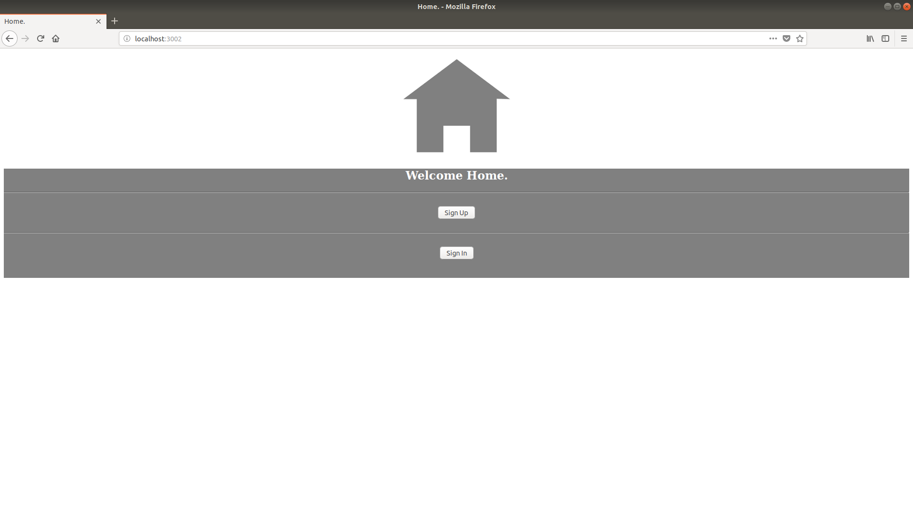

# FormWebApp
A simple form submission web app made using Node, Express and MySQL.

When the server.js file is run on the localhost, the home page is displayed :

- When the Sign In button is clicked, the registration form page is displayed :

When the user submits all the required data, a "Success" page is displayed:

- When the user opts to sign in from the Home page, the log in page is displayed:

And if the user enters the correct registered data, a "Successful login" page is shown:
 

All of the user data is stored in a MySQL database. 

Features coming soon: client side verification of data, encrypted password storage, better interface.
